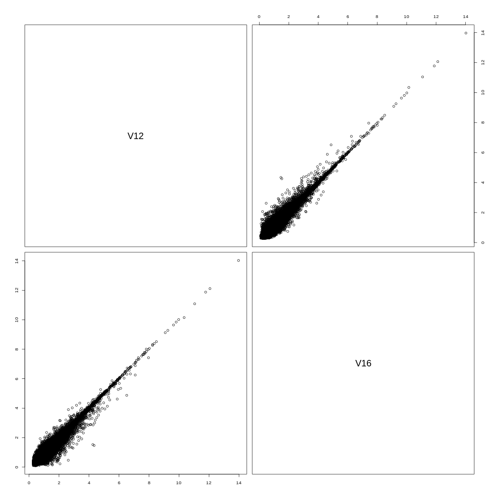

This writeup concerns only the susy100k datasets given in the Fall 2020 CS6513  Big Data Course

# Data Cleanup

I ran the dataset through R, and checked whether there were some features I could leave out, or some heuristics I could run to reduce the dimensionality of the dataset.

I found that features V12 and V16 (M_R, and S_R according to the [UCI Machine Learning Repository's Susy Repository](https://archive.ics.uci.edu/ml/datasets/SUSY)) was strongly correlated at 0.98

Unfortunately removing this one feature didn't affect performance much.
I'm gonna get a little greedy and remove all correlations of > 0.7

2,12, and 16 seem correlated as well so I will remove 12 as well

13 is correlated with 2 and 8 with 0.72 (but not 2 and 8) so we remove 13
17 with 15 and 10 more so with 15 (but not 15 and 10) so we remove 17

This does help improve performance a little.

When I run both with the missing columns and without, after sorting the outputs they are identical

"","V1","V2","V3","V4","V5","V6","V7","V8","V9","V10","V11","V12","V13","V14","V15","V16","V17","V18","V19"
"V1",1,0.39,0,0,0.2,0,0,0.44,0,0.29,0.08,0.27,0.43,0.11,0.08,0.26,0.27,0.04,0.27
"V2",0.39,1,0,0,0.69,0,0,0.39,0,0.16,-0.02,0.85,0.72,-0.19,-0.02,0.81,0.23,-0.15,0.16
"V3",0,0,1,0,0,0.41,0,0,0,0,0,0,0,0.01,0,0,0,0,0.01
"V4",0,0,0,1,0,0,-0.26,0,-0.19,0,0,0,0,0,0,0,0,0,0
"V5",0.2,0.69,0,0,1,0,0,0.14,0,0,0.07,0.8,0.43,-0.32,-0.12,0.8,0.02,-0.01,-0.22
"V6",0,0,0.41,0,0,1,0,0,0,0,0,0,0,0,0,0,0,-0.01,0.01
"V7",0,0,0,-0.26,0,0,1,0,-0.04,0.01,0,0,0,0.01,0,0,0,0.01,0
"V8",0.44,0.39,0,0,0.14,0,0,1,0,0.7,0.18,0.27,0.72,0.45,0.21,0.31,0.58,0.38,0.43
"V9",0,0,0,-0.19,0,0,-0.04,0,1,0,0,0,0,0,0,0,0,0,0
"V10",0.29,0.16,0,0,0,0,0.01,0.7,0,1,-0.14,0.08,0.58,0.6,0.54,0.15,0.75,0.38,0.32
"V11",0.08,-0.02,0,0,0.07,0,0,0.18,0,-0.14,1,0.02,-0.32,-0.38,-0.53,-0.07,-0.37,-0.06,-0.27
"V12",0.27,0.85,0,0,0.8,0,0,0.27,0,0.08,0.02,1,0.58,-0.38,-0.07,0.98,0.19,-0.1,-0.12
"V13",0.43,0.72,0,0,0.43,0,0,0.72,0,0.58,-0.32,0.58,1,0.38,0.38,0.64,0.67,0.23,0.45
"V14",0.11,-0.19,0.01,0,-0.32,0,0.01,0.45,0,0.6,-0.38,-0.38,0.38,1,0.58,-0.29,0.56,0.42,0.63
"V15",0.08,-0.02,0,0,-0.12,0,0,0.21,0,0.54,-0.53,-0.07,0.38,0.58,1,-0.02,0.81,0.06,0.26
"V16",0.26,0.81,0,0,0.8,0,0,0.31,0,0.15,-0.07,0.98,0.64,-0.29,-0.02,1,0.25,-0.01,-0.09
"V17",0.27,0.23,0,0,0.02,0,0,0.58,0,0.75,-0.37,0.19,0.67,0.56,0.81,0.25,1,0.16,0.32
"V18",0.04,-0.15,0,0,-0.01,-0.01,0.01,0.38,0,0.38,-0.06,-0.1,0.23,0.42,0.06,-0.01,0.16,1,0.11
"V19",0.27,0.16,0.01,0,-0.22,0.01,0,0.43,0,0.32,-0.27,-0.12,0.45,0.63,0.26,-0.09,0.32,0.11,1
